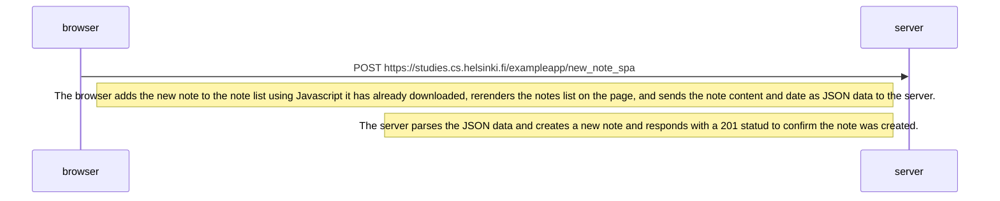

```mermaid
sequenceDiagram
    participant browser
    participant server

    browser->>server: POST https://studies.cs.helsinki.fi/exampleapp/new_note_spa

    Note right of browser: The browser adds the new note to the note list using Javascript it has already downloaded, rerenders the notes list on the page, and sends the note content and date as JSON data to the server.

    Note left of server: The server parses the JSON data and creates a new note and responds with a 201 statud to confirm the note was created.
```
