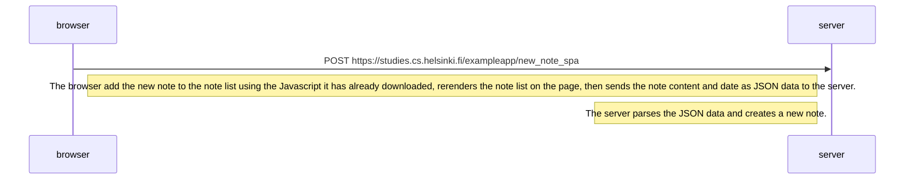

```mermaid
sequenceDiagram
    participant browser
    participant server

    browser->>server: POST https://studies.cs.helsinki.fi/exampleapp/new_note_spa

    Note right of browser: The browser add the new note to the note list using the Javascript it has already downloaded, rerenders the note list on the page, then sends the note content and date as JSON data to the server.

    Note left of server: The server parses the JSON data and creates a new note.
```
